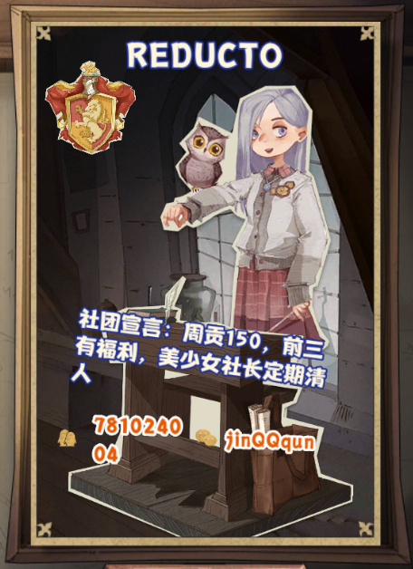

# 普莉可奈基金会
信息公示初版，部分数据可能有误，修正中...

[**普利可奈资助者**](wiki/contributions.md)

[~~普利可奈宗旨~~](wiki/purpose.md)

[我们的目标是星辰大海！](wiki/star_sky.md)

# 近期活动
## 魔法部暖冬活动

### 时间 
2021-12-6 至 2021-12-7
### 资格
活动时间内社团活动开始前（21:00）加群的社员
### 活动内容
>社团活动请大家统一选社团问答

当日社团贡献第一可获得游戏内暖冬问候，包括:
* 暖冬头像框
* 雪鸮疑问
* 图书馆券*5

> 已经购买可折现软妹币 20

### 获奖名单
|昵称|时间|奖项|
|:---:|:---:|:---:|
|猫爵达芙妮|2021-12-6|图书馆券*2|
|帅月亮|2021-12-6|图书馆券*2|
|瓜皮人机|2021-12-7|暖冬问候|

本活动最终解释权归 **魔法社社长咸蛋蛋** 所有

## PCR 十一月公会战圆满结束

~~本期劳模~~【**出刀/代刀排行榜**】:

| 排位    | 出刀机器   | 刀数|
| :-------------: | :-------------: |:-------------: |
| 第1名：| 咖喱(闲鱼ing)|  共出刀48次|
| 第2名：| 朱故意 | 共出刀47次|
| 第3名：| 春卷（混 | 共出刀38次|
| 第4名：|贾斯汀黄渤 | 共出刀23次|
| 第5名：| 冰冰（宝宝刀手|  共出刀23次|
| 第6名：| 阿狗 | 共出刀23次|
| 第7名：| 楚轩 （修养生息仓鼠） | 共出刀23次|
| 第8名：| 杼书‎|  共出刀23次|
| 第9名：| 可乐 |共出刀21次|
| 第10名：| 出差加班战犯的皮皮 | 共出刀21次|

感谢以上人员的辛苦付出 ~~我们下期再见！~~

## 魔法部持续招新中

## 第四届普利可奈雀魂杯筹备中

**欢迎入资**

入资福利：
1. 芊伊麻麻的认可
2. 赞助名单上感恩比心
3. 当期前二直邀名额
4. 参与规则的制订与修改
5. 饿饿，饭饭

## 第三届普利可奈雀魂杯已结束
> 奖励由神威负责分发

[**赛事回顾**](archive/MajSoulGame/games/3rd.md)

#### 赛后总结与前瞻

>第三届举办过程中出现的问题：
1. 信息传播效率低：部分会员未及时收到报名信息或参赛信息
2. 时间仓促：未能兼顾参赛选手时间表
3. 16 强分组不合理：全随机分配导致 A 组包揽海选 5 强中的 **3** 位

>第四届筹备中

1. 时间：以 PCR 会战为周期，每 3 次会战举行一次比赛，第四届将于后两次公会战结束后开启，时长将延长至两周。
2. 主办方继续由神威领导，从云、布丁协助，包括雀魂比赛创办、报名、海选、正赛管理、奖励分发
3. 最终解释权归赞助者所有（第四届赞助募集中，上限金额 500 软妹币，无最低赞助要求，赞助者可选择不公布具体金额）
4. 16 强分组将采用 A B C D 打乱分组，确保 1~4\5~8\9~12\13~16 不被分到一组
5. 为减少比赛的运气成分，赛制将采用神威提议的双败赛制
6. 赛事更新仍然以 [普莉可奈基金会](https://gitee.com/nanaloli/PriConneFoundation) 主页为准，参赛者务必关注更新

# 普利可奈雀魂杯
[更多信息点击前往](archive/MajSoulGame/README.md)
