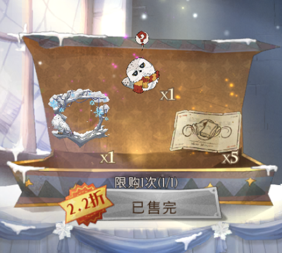
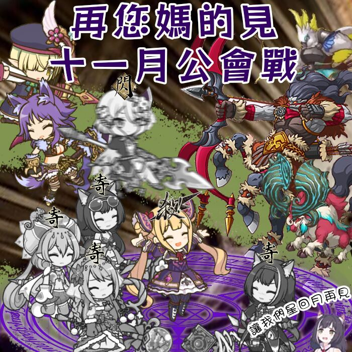
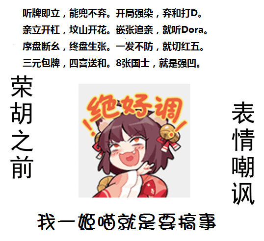

# 普莉可奈基金会
信息公示初版，部分数据可能有误，修正中...

[我们的目标是星辰大海！](star_sky.md)

# 公会贡献
**感谢全体为公会做出贡献的会员！**

>公会贡献目前阶段以资助成本、时间成本为主要衡量标准
>
* 资助成本包括各种方式的宣传、奖励、节日红包、虚拟货币等资金注入（不包括挂树补偿、代刀补偿）
* 时间成本主要包括宣传、会战等工作

## 创会以来资助成本、时间成本信息
* 资助成本包括各种方式的宣传、奖励、节日红包、虚拟货币等资金注入（不包括挂树补偿、代刀补偿）
* 时间成本主要包括宣传、会战、活动等

| 赞助人     | 资助成本/软妹币   | 时间成本/h|
| :-------------: | :-------------: |:-------------: |
|芊伊|7777|1200+|
|████|不公开|600+|
|神威|1500+|300+|
|从云|1000+|800+|
|落落|不公开|1000+|
|提子|不公开|800+|
|手机壳|统计中|300+|
|咸蛋|200+|100+|
|卷宝|不公开|800+|
|小朱|200+|500+|
|阿狗|不公开|400+|
|酷润|不公开|500+|
|栗子|不公开|200+|
|千雨|不公开|300+|
|杼书|0|100+|

# 近期活动
## 魔法部暖冬活动

### 时间 2021-12-6
### 资格
在社团活动开始前（21:00）加群的社员
### 活动内容
>社团活动请大家统一选社团问答

贡献第一可获得游戏内暖冬问候，包括:
* 暖冬头像框
* 雪鸮疑问
* 图书馆券*5

> 已经购买可折现软妹币 20

本活动最终解释权归 **魔法社社长咸蛋蛋** 所有

## PCR 十一月公会战圆满结束

~~本期劳模~~【**出刀/代刀排行榜**】:

| 排位    | 出刀机器   | 刀数|
| :-------------: | :-------------: |:-------------: |
| 第1名：| 咖喱(闲鱼ing)|  共出刀48次|
| 第2名：| 朱故意 | 共出刀47次|
| 第3名：| 春卷（混 | 共出刀38次|
| 第4名：|贾斯汀黄渤 | 共出刀23次|
| 第5名：| 冰冰（宝宝刀手|  共出刀23次|
| 第6名：| 阿狗 | 共出刀23次|
| 第7名：| 楚轩 （修养生息仓鼠） | 共出刀23次|
| 第8名：| 杼书‎|  共出刀23次|
| 第9名：| 可乐 |共出刀21次|
| 第10名：| 出差加班战犯的皮皮 | 共出刀21次|

## 魔法部持续招新中

## 第四届普利可奈雀魂杯筹备中

**欢迎入资**

入资福利：
1. 芊伊麻麻的认可
2. 赞助名单上感恩比心
3. 当期前二直邀名额
4. 参与规则的制订与修改
5. 饿饿，饭饭

## 第三届普利可奈雀魂杯已结束
> 奖励由神威负责分发

[**赛事回顾**](./archive/MajSoulGame/3rd.md)

#### 赛后总结与前瞻

>第三届举办过程中出现的问题：
1. 信息传播效率低：部分会员未及时收到报名信息或参赛信息
2. 时间仓促：未能兼顾参赛选手时间表
3. 16 强分组不合理：全随机分配导致 A 组包揽海选 5 强中的 **3** 位

>第四届筹备中
1. 时间：以 PCR 会战为周期，每 3 次会战举行一次比赛，第四届将于后两次公会战结束后开启，时长将延长至两周。
2. 主办方继续由神威领导，从云、布丁协助，包括雀魂比赛创办、报名、海选、正赛管理、奖励分发
3. 最终解释权归赞助者所有（第四届赞助募集中，上限金额 500 软妹币，无最低赞助要求，赞助者可选择不公布具体金额）
4. 16 强分组将采用 A B C D 打乱分组，确保 1~4\5~8\9~12\13~16 不被分到一组
5. 为减少比赛的运气成分，赛制将采用神威提议的双败赛制
6. 赛事更新仍然以 [普莉可奈基金会](https://gitee.com/nanaloli/PriConneFoundation) 主页为准，参赛者务必关注更新

# 普利可奈雀魂杯
[更多信息点击前往]((archive/MajSoulGame/README.md))
## 历届赞助者
| 赞助人     | 第一届    | 第二届     | 第三届    | 总计    |
| :-------------: | :-------------: |:-------------: | :------------: |:-------------: |
|神威 |648|648| | 1 296 |
|布丁|998| |249|1247|
|从云| |500|500|1000|
|咸蛋| | |251|251|
|杼书| | |0|0|

部分赞助者信息：
* 神威：提瓦特大陆扛把子、云图计划执行人、涩图机器；
* 从云：~~清澄高中麻将部大将~~, 技能岭上被开花；
* 咸蛋：霍格沃兹魔法部部长、奇迹暖暖爱心妈妈；
* **杼书**：竹鼠，三元一只，十元三只，本体其实是鸽子；

## 历届奖池
> 经赞助人员一致决定，赛事资金和奖励将统一交由神威管理和分配，剩余资金将用于下一届比赛。

| 排名\奖金     | 第一届    | 第二届     | 第三届    |
| :-------------: | :-------------: |:-------------: | :------------: |
|冠军| 648|648|648|
|亚军|328|328|328|
|季军|128|128|128|
|殿军|98|98|98|
|幸运奖|30|30|30|
|点炮奖|0|0|30|
|奖池剩余|0|0|172|

> 由于某人懒得抽，幸运奖跟点炮奖 ~~没发~~ 并入下一届奖金池

**重要**：
1. 四强奖励仅限于**游戏内消费，不可折现**，不限制游戏内使用方式（可分开购买辉玉、御守、服装券，建议优先选择首充双倍）；
2. 幸运奖从四强以外**所有参赛人员**中随机抽取，可选择游戏内御守/月卡 或 折现 20 软妹币；
3. 点炮奖为新追加奖项，16 强比赛中**放铳点数最高者**才能获得此荣誉，不可与幸运奖叠加。

## 历届四强
| 四强    | 第三届    | 第二届     | 第一届  |
| :-------------: | :-------------: |:-------------: | :------------: |
|冠军|栗子|神威|血月|
|亚军|从云|杼书|宫永姊|
|季军|布丁|落落是天|从云|
|殿军|酷润|和子|杼书|

## 历届比赛牌谱
| 第一届    | 第二届     | 第三届    |
| :-------------: | :-------------: | :------------: |
|[半决赛·上][1]|[半决赛·上][4]|[决赛·上][7]|
|[半决赛·下][2]|[半决赛·下][5]|[决赛·下][8]|
|[决赛][3]|[决赛][6]|None|

[1]: https://game.maj-soul.com/1/?paipu=200905-47075ae6-5faa-4d41-9cee-261464b62579_a85449483
[2]: https://game.maj-soul.com/1/?paipu=200905-44b7d7c0-3cc9-4ef8-a98c-ba547d9f997b_a85449483
[3]: https://game.maj-soul.com/1/?paipu=200905-e037fa1c-6221-4a43-acbd-92ca21b7bd5d_a85449483
[4]: https://game.maj-soul.com/1/?paipu=210222-0f785698-b95b-478d-81a6-64ad0c025de2_a85449483
[5]: https://game.maj-soul.com/1/?paipu=210222-376d5f33-795e-4b29-bc18-0d0d7b0e02cc_a85449483
[6]: https://game.maj-soul.com/1/?paipu=210222-565d2ecc-0c61-449e-a402-f39a52cf5eb8_a85449483
[7]: https://game.maj-soul.com/1/?paipu=211114-85e77fd3-f16b-4862-9d7c-7cc4739d7da8
[8]: https://game.maj-soul.com/1/?paipu=211114-9dddb854-47ee-4c5e-8495-0e16370679da
