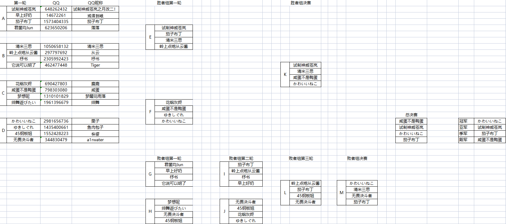

# 普莉可奈基金会
信息公示初版，部分数据可能有误，修正中...

- [**普利可奈资助者**](wiki/contributions.md)

- [~~普利可奈宗旨~~](wiki/purpose.md)

- [我们的目标是星辰大海！](wiki/star_sky.md)

# 近期活动

##  云顶之寄分部

### 第二届普莉可奈云顶之寄杯（报名中）

详情可见 [云顶之寄S2](archive/TeamFightTactics/S2.md)

> [**往期活动**](archive/TeamFightTactics/README.md)

##  魂天神社分部
###  第四届普利可奈雀魂杯圆满结束

比赛结果如下，具体可见 [雀魂杯S4](archive/MajSoulGame/4th.md)

最终 **四强** 如下：

| 排名 | 游戏昵称     | QQ昵称 |
| ---- | ------------ | ------ |
| 冠军 | かわいいねこ | 栗子   |
| 亚军 | 试制神威苍岚 | 神威   |
| 季军 | 茄子布丁     | 布丁   |
| 殿军 | 咸蛋不是鸭蛋 | 咸蛋   |

[**往期活动**](archive/MajSoulGame/README.md)

##  兰德索尔分部
### 四月会战结束

>麻酱！！！！！！

>欢迎加入普莉可奈萌新保护区

> [**往期活动**](archive/PCR/README.md)

## 霍兹沃格分部
### 持续招新中

>球球大家快来吧

> [**往期活动**](archive/HarryPotter/README.md)
