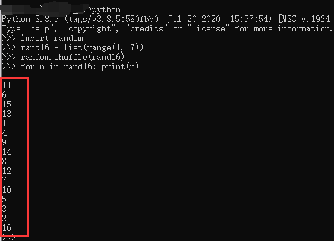
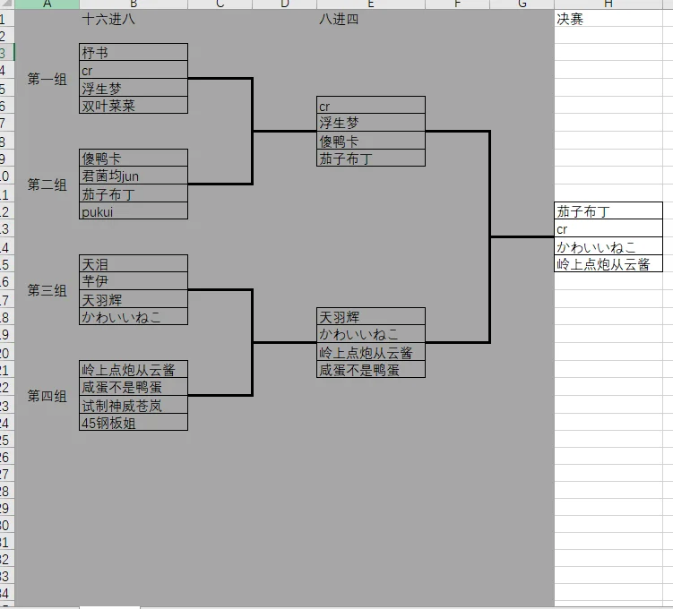
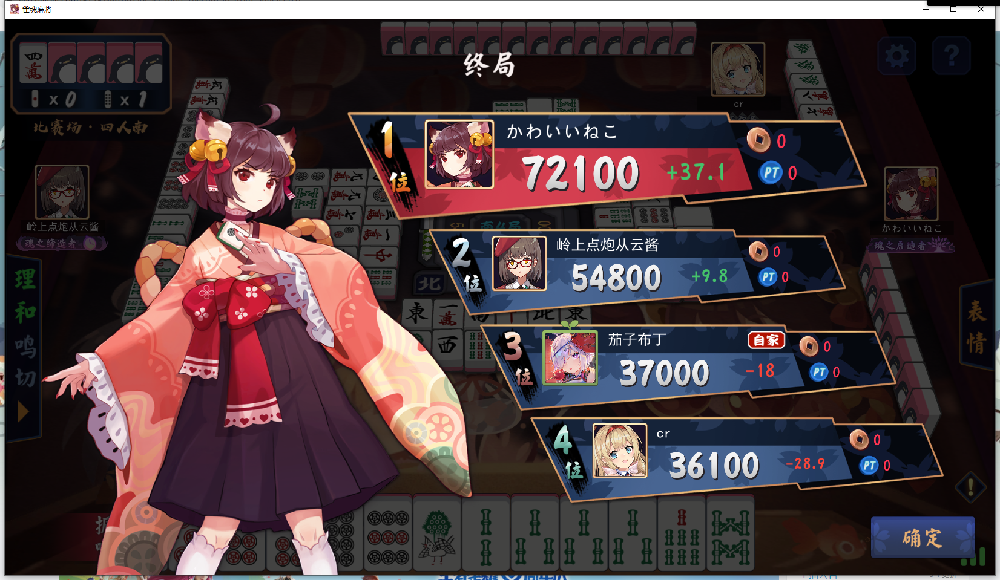

## **第三届普莉可奈雀魂杯**

**状态：已结束**

--------------------------------------------
>本次赛事由 **杼书**、从云、布丁、咸蛋 赞助，欢迎入资。
>赛事规则、时间、奖励以本页面为准。


报名时间截至：2021.11.13（周六） 21:00:00

报名资格：
1. 直邀名额：第二届冠军神威，第一届冠军血月；
2. 赞助人员： **杼书**、从云、咸蛋，占比前二享有直邀权；
3. 公会管理：芊伊、落落、卷宝、阿狗、小朱、提子、栗子；
4. 2021.11.9 日 19:00 前加入普利可奈的会员。

>其中 1、2、3 名额可以转让或弃权, 资格不限，但奖励只给予参赛者

> 4 必须在报名截止时间前按格式向神威或布丁提交：QQ昵称 QQ号 雀魂昵称 雀魂ID，如： 七岁萝莉 1573404335 茄子布丁 50330641 。

### 赛事 id: **322906**
现已开启全天自动匹配，欢迎关注。

### 比赛规则：
* 海选：除直邀名额外，所有参赛者至少打满 5 局东风场比赛；
* 16 强：取海选时最佳连续 5 局精算点数进行排位的前 16-N 名（N 为直邀名额）；
* 16 - 8 - 4： 一个南风场（半庄），前两位晋级下一轮；
* 决赛： 2 个半庄（取最佳精算点）

### 比赛时间安排
* 16 强决出：2021.11.13/周六 23 点前；
* 16-8-4：2021.11.13/周六 23 点 ~ 2021.11.14/周日 19 点；
* 决赛：2021.11.14/周日 20 点。

**最终解释权由赞助人员所有。**

## 本届海选 16 强
**海选积分已作废**

|名次|	玩家ID|	昵稱|	得分|	對局數量|
|:---:|:---:|:---:|:---:|:---:|
|1|	76608779|	傻鸭卡|	171|	16|
|2|	73656459|	试制神威苍岚|	128.7	|23|
|3	|68905883	|咸蛋不是鸭蛋	|124.1|	16|
|4	|74781726	|君菌均Jun	|95.2	|26|
|5	|61058590	|岭上点炮从云酱	|61.5	18|
|6	|62143242	|cr	|51.2	|9|
|7	|22700693|	天羽辉	|39	|12|
|8	|44580873|	天泪|	21.7	|9|
|9|	50330641|	茄子布丁|	18	|8|
|10	|55747211|	かわいいねこ|	4.1|	9|
|11	|65301662	|杼书|	4	|18|
|12	|65884443	|芊伊	|0.8|	5|
|13	|71375262|	双叶菜菜|	0.5	|5|
|14	|15664411|	pukui|	-0.2|	5|
|15	|18669962|	浮生夢	|-2.3	|5|
|16	|28558611|	45钢板姐|	-9.4|	9|

根据**名次编号**随机分组如下：
```text
1 [11 6 15 13]
2 [1  4  9 14]
3 [8  12 7 10]
4 [5  3  2 16]
```
* 1、2 组前 2 进行 4 进 2（半决赛 上）
* 3、4 组前 2 进行 4 进 2（半决赛 下）
* 两组半决赛前 2 进行决赛

**具体时间选手可自行调整，确认时间后找神威或布丁开赛**

**若选手无暇参与比赛，可指定好友参与比赛，但比赛奖励减半且归参赛好友，选手本人无奖励**

**若选手弃权，将由神威、咸蛋、包砸或布丁参与比赛但不参与排名，比赛结果仍取参与排名的前两位**


### 分组方式公示：



## 比赛结果

### 16 进 8 进 4
结果如下：


### 决赛
|名次|选手|
| :-------------: | :-------------: |
|冠军|栗子|
|亚军|从云|
|季军|布丁|
|殿军|酷润|

