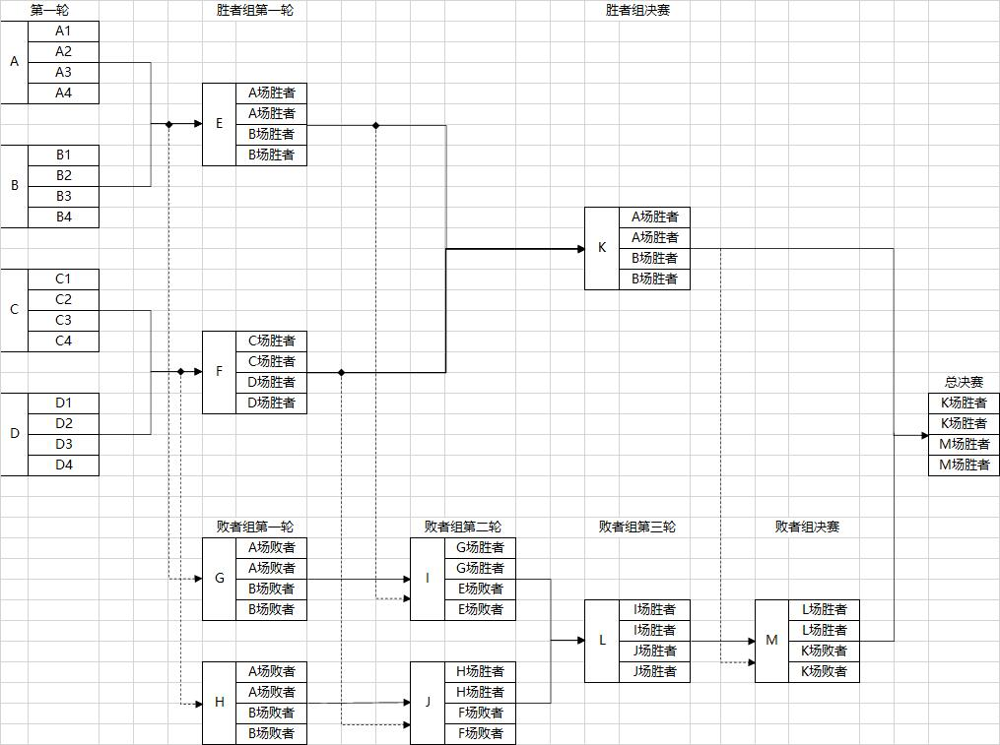

# 第四届普利可奈雀魂杯
> **状态：初赛中**

赛事 id: 798351

- 春季赛，S4
- 为减少比赛的运气成分，采用双败赛制
- 考虑到打工人时间较少，放宽赛事时长
- 赛事更新以 [普莉可奈基金会](https://gitee.com/PriConneFoundation/PriConneFoundation) 主页为准，参赛者务必关注更新
- **最终解释权归赞助者所有**

## 1 报名阶段

> 除直邀名额外，其他参赛者必须报名参加初赛

报名条件：**正月初五前** 加入普莉可奈碎觉ฅ(˘ω˘ )ฅ群（423685729）或普莉可奈划水群（1030576153）的群员

[**报名链接**](https://docs.qq.com/form/page/DU014RExYa3VkdHhs#/fill) (**已结束报名**)

> 报名后若无法进入比赛，请与神威或布丁联系手动添加到参赛名单

赛事 id: **322906**，现已开启全天自动匹配

## 2 初赛阶段
比赛规则：
- 四人东
- 无西入
- 无击飞
- 无多倍役满
- 听牌连庄
- **排名取最佳连续 5 战精算点**

> 详细规则游戏内查看

> 除直邀名额外，所有参赛者均需要参与至少 5 局比赛， **否则视为弃权**

## 3 正赛阶段：
**直邀名额** ：

1. 最近两届冠军
2. 赞助者前两位

> 1、2 可选择自己参赛或转让直邀名额给初赛者，但比赛奖励打六折且归参赛者所有

> 1、2 可以放弃直邀参加初赛，凭实力说话（负分警告

正赛参赛者：
- N 名直邀名额
- 直邀名额外的初赛前 16 - N 名

比赛规则：
- 采用双败赛制
- 16 名参赛者将按排名（直邀名额为同一组）分为 A B C D 四组再打乱重组，确保 `1~4\5~8\9~12\13~16` 不被分到一组
- 决赛阶段前均为一局南风场，前两位晋级下一轮，缺席将由（神威、从云、布丁、咸蛋 或 bot）补位但不参与结算排名，两人以上缺席小组其他参赛者直接晋级
- 决赛为 3 局南风场，按决赛 3 局精算点排名
- 具体时间由参赛者自行协商，越早越好（不要影响复活赛）
- 其他规则与初赛阶段相同

## 4 比赛时间安排

* 报名阶段：正月初五（2022.02.05） 23点前 （**已结束**）
* 初赛阶段：报名后即可参赛，至报名结束后一周内（本周六，2022-02-12 23点前）
* 正赛阶段：初赛结束分组结束后（本周六，2022-02-12 23点后），参赛者可自行安排时间，务必于元宵节（2022-02-15 15点前选出四强）
* 决赛阶段：元宵节，2022-02-15 15点后，当天完成决赛

> 初赛未完成最低比赛局数要求（5局）的视为弃权

> 普莉可奈第一届云顶之寄比赛筹备中，平台暂定为手游金铲铲之战S4，拟定16人参赛， **暂不接受报名** ，规则奖励待定
## 5 赛事奖励

奖励均以雀魂游戏商城内等价物品(月卡、辉玉、服装券等)结算，由神威统一管理和发放，**不可折现！** （真的不可以哦，没得 **商量** 哦，小声

> 为了比赛可持续发展，当届奖池将保留 20 % 并入下一届比赛 ~~无限套娃，奖池永不为0！~~

| 奖池 | 用处                                  |
| :--: | ------------------------------------- |
| 20%  | 预留至下一届                          |
| 30%  | 冠军奖励                              |
| 20%  | 亚军奖励                              |
| 10%  | 季军奖励                              |
| 10%  | 殿军奖励                              |
|  5%  | 天选之人（最稀有役成者 ~~夺命九莲~~） |
|  5%  | 放铳高手（单场比赛中飞的最高的人）    |

> 天选之人、放铳能手均从 **四强以外** 参赛选手中选择

> 若无役满则天选之人从参赛选手（含初赛）选手中随机抽取

**欢迎入资！**

上限金额 518 软妹币，赞助者可选择不公布具体金额

入资福利：

- 当期前二直邀 16 强
- 参与规则的制订与修改
- 赞助名单感恩比心
- ~~自产自销内部消化名利双收（我没说神威，你们特别乱说）~~

|  赞助人  | 金额      |
| :------: | --------- |
|   咸蛋   | 518       |
|   麋鹿   | 100       |
|   布丁   | ███       |
|   杼书   | 0         |
| 上届预留 | 172       |
|  总奖池  | 790 + ███ |

> 某萝莉准备转让直邀给神秘女主播，谁给的自信？！笨笨吗？？？冲榜让他三！

## 6 参赛名单
直邀：

| 昵称 | 名额       |
|---|---|
|栗子|第三届冠军|
|神威|第二届冠军|
|麋鹿|赞助者|
|███|███|

所有参赛者名单：
=======
已报名名单：
|    雀魂昵称    |
| :------------: |
|    钢板45姐    |
|   ゆきしぐれ   |
|      绯舞      |
|    茄子布丁    |
|       cr       |
| 岭上点炮从云酱 |
|  试制神威苍岚  |
|   君菌均Jun    |
|  咸蛋不是鸭蛋  |
|  かわいいねこ  |
|     浮生夢     |
|     pukui      |
|      杼书      |
|      芊伊      |
|      天泪      |
|     叶舒然     |
|    為寧所願    |
|     天羽辉     |
|      ████      |
|    為寧所願    |
|     清夏w      |
|    早上好奶    |
|     梦想呢     |
|  不要香菜谢谢  |
|  它说可以胡了  |
|    花烟灰烬    |
|   白送的老白   |
|   无畏决斗者   |
|      影丿      |
